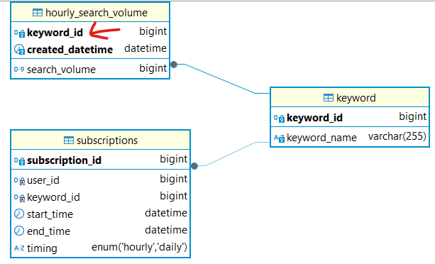
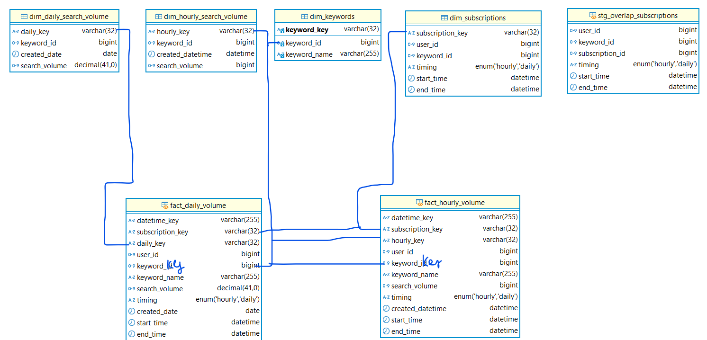

# Vulnerability in Data Warehouse  Design

Trong cấu trúc bảng dữ liệu nguồn, cột keyword_id là `mã duy nhất` và gắn liền với mọi hoạt động `nghiệp vụ` của đối tượng keyword đó. Do nó có độ ảnh hưởng lớn trong các hoạt động truy vấn keyword, nên một sự thay đổi (update) có thể khiến kết quả truy vấn từ Data Warehouse sẽ không đồng nhất

Lý do:



Câu truy vấn trong API khi kiểm tra tính lệ của request sử dụng `bảng keyword` để kiểm tra keyword_id có tồn tại hay không. Giả sử khi thay đổi keyword A từ `id=8 thành id=11`, thì kết quả sẽ `không có` dữ liệu keyword đó và trả về lỗi request không hợp lệ

```sql
-- Truy vấn dữ liệu trong API
SELECT 
    subscription_key
FROM dim_subscriptions
WHERE user_id=keyword.user_id
AND timing=keyword.timing
AND keyword_id IN (SELECT keyword_id FROM keyword WHERE...)
AND NOT (
    (end_time<'{keyword.start_time}') OR (start_time>'{keyword.end_time}')
);
```

Tương tự quá trình biến đổi và load dữ liệu lên Data Warehouse, em sử dụng keyword_id để liên kết keyword với các bảng khác để tạo nên bảng fact. Nếu thay đổi giá trị keyword_id, thì trong fact sẽ chứa `một keyword_name` với nhiều `keyword_id khác nhau`

```sql
-- Truy vấn tạo bảng fact_hourly_volume
SELECT
    CAST(UNIX_TIMESTAMP(h.created_datetime) AS CHAR(255)) AS datetime_key,
    s.subscription_key, h.hourly_key, s.user_id, 
    h.keyword_id, k.keyword_name, h.search_volume, 
    s.timing, h.created_datetime, s.start_time, s.end_time
FROM {{ ref("dim_subscriptions") }} s
JOIN {{ ref("dim_hourly_search_volume") }} h
	ON h.keyword_id=s.keyword_id AND (h.created_datetime BETWEEN s.start_time AND s.end_time)
JOIN {{ source("epsilo", "keyword") }} k
	ON k.keyword_id=s.keyword_id
```

Nhưng bảng fact sẽ là nơi API truy vấn để lấy dữ liệu, cho dù request có vượt qua được đoạn kiểm tra hợp lệ thì cũng `không thể` trả về giá trị của keyword_id bị thay đổi đó. Bởi vì em dùng `INNER JOIN` để liên kết, nếu `keyword_id=11` không tồn tại trong `dim_subscriptions` thì sẽ không liên kết.

# Proposal Solution

Tạo thêm một bảng dimension cho keyword, trong đó sẽ dùng cột `keyword_key` (là surrogate key) đóng vai trò là `khóa thay thế` cho keyword_id và nó sẽ không liên hệ gì tới nghiệp vụ của đối tượng, đơn thuần chỉ là `số thứ tự` trong bảng. 

Dùng nó để liên kết dữ liệu ở các công đoạn biến đổi sẽ đảm bảo được `thống nhất và toàn vẹn dữ liệu`. Bởi vì, cho dù keyword_id có thay đổi ra sao (hoặc các cột khác) thì cột được liên kết vẫn là keyword_key

Tương tự như các bảng dimension khác, định kỳ sẽ thu thập dữ liệu từ bảng keyword và `cập nhật` các cột (bao gồm keyword_id) nếu có thay đổi và `giữ nguyên` cột keyword_key. Các bảng fact sẽ liên kết dim_keywords thông qua cột keyword_key, đảm bảo tính toàn vẹn dữ liệu.

Thiết kế lại Data Warehouse như sau:



# Những điểm chưa cover

Các bảng dimension đang được load bằng kiểu `SCD Type 1`, tức là thực hiện `upsert`, dẫn đến các dữ liệu trong quá khứ sẽ không được ghi lại. Ví dụ công ty thực hiện thay đổi cách đánh id, thì sẽ thay đổi keyword_id tại source, sau khi load mới sẽ cập nhật keyword_id trong dimension. Dẫn tới các bản ghi thuộc keyword_id cũ trong các bảng dimension `không thể` được tham chiếu tới từ fact .

Nên dùng `SCD Type 2` kèm thêm cột `row_is_current`, để keyword_id cũ vẫn được dữ liệu và cột đó bằng false (nghĩa là ko còn hoạt động). Từ đó, các cột tham chiếu từ fact có thể tiếp tục liên kết với keyword_id cũ, và lưu trữ lại `dữ liệu lịch sử`.